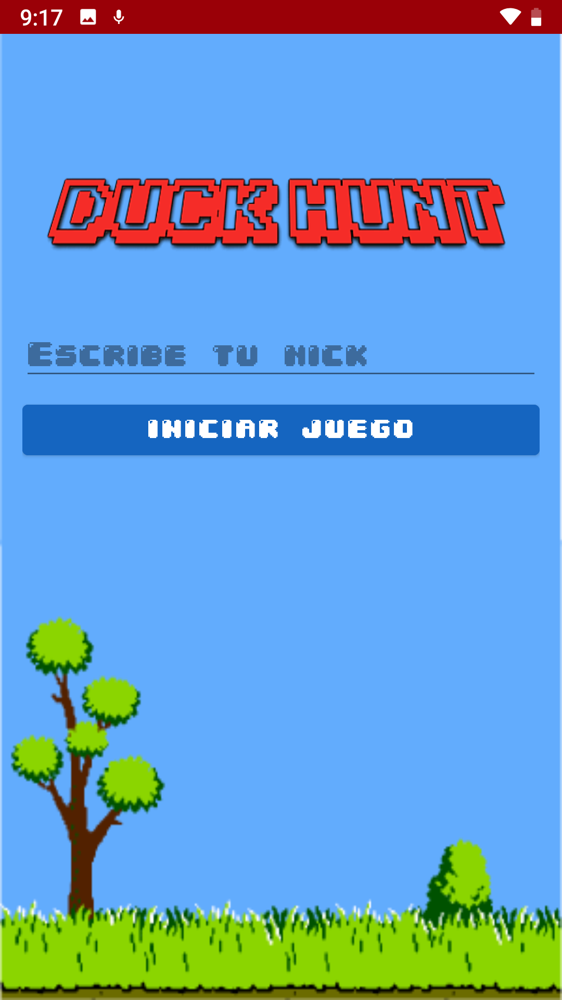
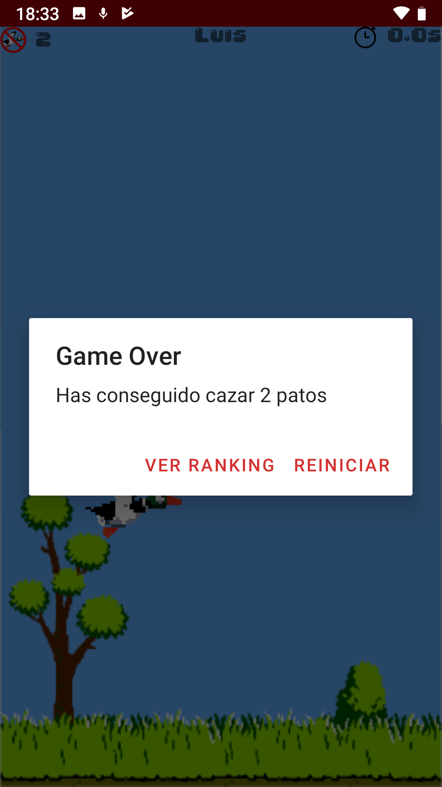
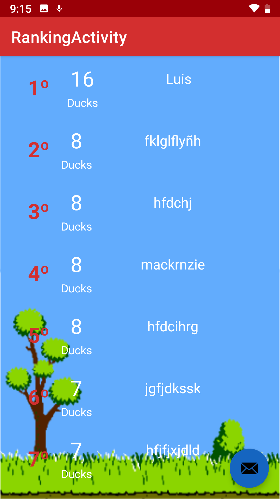
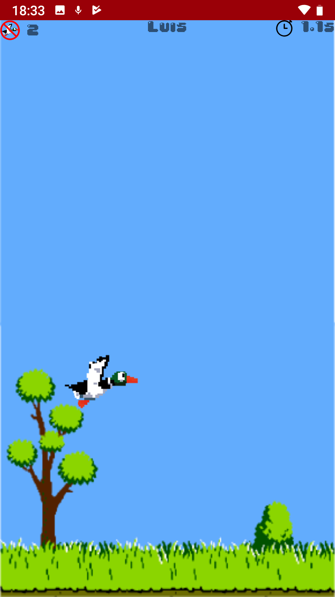
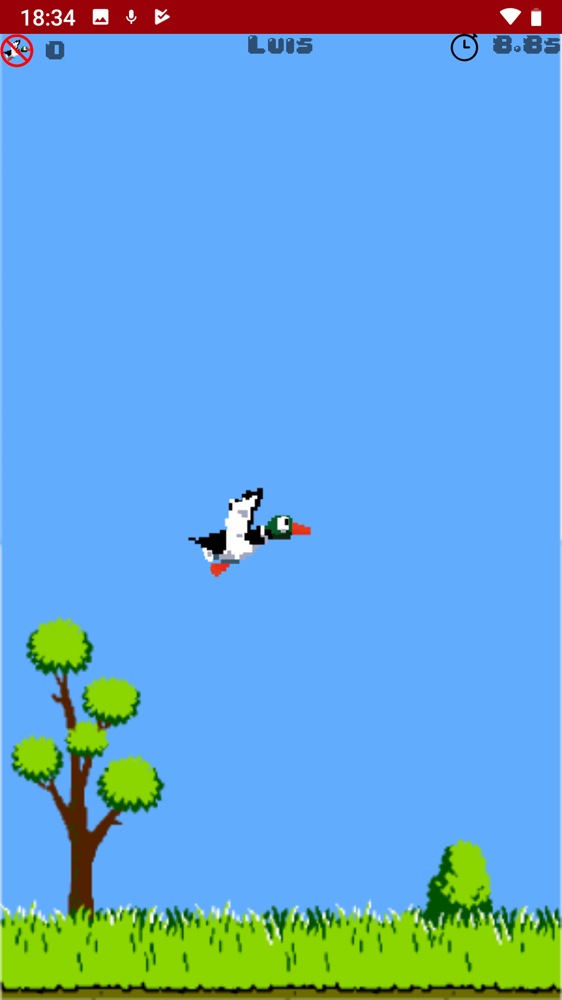
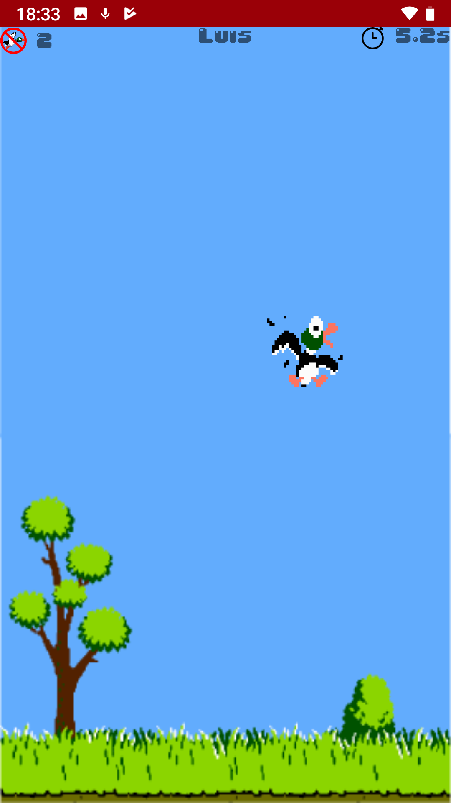

# Duck Hunt Game

It is a game that consists of touching the maximum number of ducks before time runs out

|  |  |  |
| ---------------------------------------------- | -------------------------------------------- | ------------------------------------------- |
|  |  |  |

## Getting Started 🚀

### Setup development environment 📋

* [Android Studio](https://developer.android.com/studio)

* [Android SDK Tools](https://developer.android.com/studio#Other)

* [Firebase Account](https://firebase.google.com/?hl=es)

### Build & Run the application 🔧

1. Get the source code.

```
git clone --recursive https://github.com/LuisMackenzie/DuckHuntGame.git
```

### Notice

To use the *Firebase Firestore DB* you need to configure a Firestore DB in a *Firebase Project*:
* Create a Cloud Firestore database
* Add Firebase to your Android project. Follow the directions here: https://firebase.google.com/docs/android/setup
* Set up your development environment adding the required dependencies


## Built with 🛠️

* [Android Studio](https://developer.android.com/studio) - The Android framework recomended by Google
* [Gradle](https://gradle.org/) - Gradle, is a tool and dependency manager that allows open source compilation automation, which is focused on flexibility and performance
* [Firebase Firestore](https://firebase.google.com/?hl=es) - Flexible, scalable, cloud-based firebase NoSQL database

## Autors ✒️

* **Luis Baez** - *Initial work* - [My Github](https://github.com/LuisMackenzie)

<!--
## Licencia 📄

Este proyecto está bajo la Licencia (Tu Licencia) - mira el archivo [LICENSE.md](LICENSE.md) para detalles

## Expresiones de Gratitud 🎁

* Comenta a otros sobre este proyecto 📢
* Invita una cerveza 🍺 o un café ☕ a alguien del equipo. 
* Da las gracias públicamente 🤓.
* etc.  -->


---
⌨️ with ❤️ by [Luis](https://github.com/LuisMackenzie) 😊
